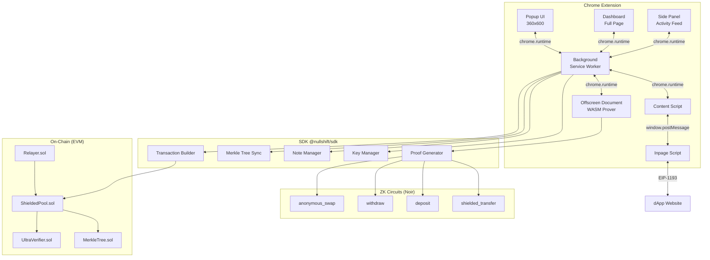
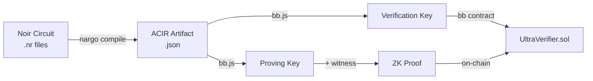
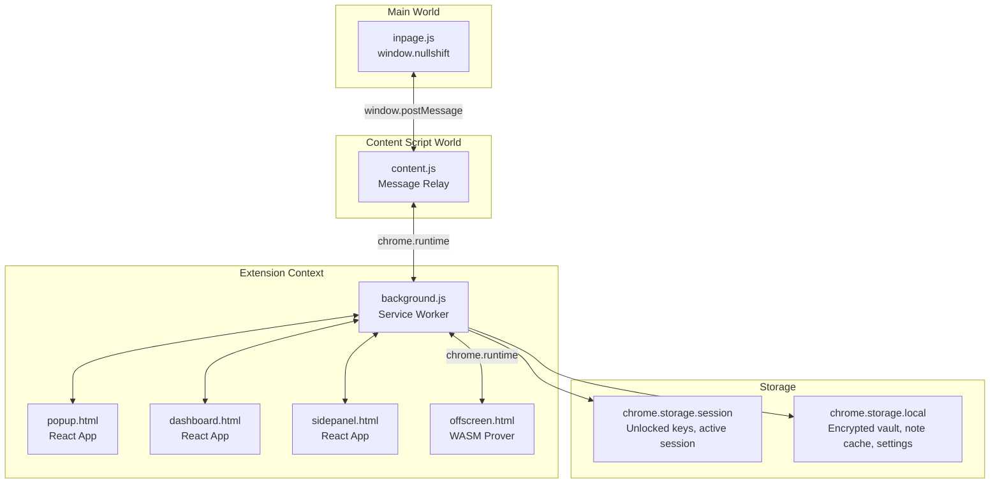

# Architecture — NullShift ZK Privacy Wallet

> **Version**: 0.1.0
> **Last Updated**: 2026-03-12

## System Overview

NullShift Wallet is a monorepo containing five packages that work together to provide private transactions on EVM chains using zero-knowledge proofs.



## Core Architecture Decisions

### 1. UTXO Commitment Model

All private funds are represented as **notes** (UTXOs):

```
Note Commitment = Pedersen(owner_pubkey, amount, salt)
Nullifier = Poseidon(commitment, owner_secret_key)
```

- Notes are stored as leaves in an on-chain Merkle tree (depth 20, ~1M notes)
- Spending a note requires revealing its nullifier (without revealing which note)
- Nullifiers are stored on-chain to prevent double-spending

### 2. Proof System Pipeline



### 3. Extension Architecture (MV3)



**Key MV3 decisions:**
- WASM proof generation in **Offscreen Document** (service workers can't run WASM efficiently)
- Encrypted vault in `chrome.storage.local`, unlocked keys in `chrome.storage.session`
- Typed message bus between all contexts via `chrome.runtime.sendMessage`

### 4. Key Hierarchy

```
BIP-39 Mnemonic (24 words)
  └── BIP-44: m/44'/60'/0'/0/0 → ETH keypair (public address)
  └── Custom: m/44'/60'/0'/1/0 → ZK Spending Key (signs notes)
  └── Derived: spending_key → Viewing Key (scan incoming notes, can't spend)
  └── Derived: spending_key → Nullifier Key (generate nullifiers)
```

### 5. Data Flow — Shielded Transfer

```mermaid
sequenceDiagram
    participant U as User (Popup)
    participant BG as Background SW
    participant OFF as Offscreen (WASM)
    participant SDK as SDK
    participant SC as ShieldedPool Contract

    U->>BG: SEND_SHIELDED {recipient, amount}
    BG->>SDK: selectUTXOs(amount)
    SDK-->>BG: selectedNotes[]
    BG->>SDK: buildCircuitInputs(notes, recipient)
    SDK-->>BG: circuitInputs
    BG->>OFF: GENERATE_PROOF {circuit: shielded_transfer, inputs}
    OFF->>OFF: bb.js: prove(acir, witness)
    OFF-->>BG: {proof, publicInputs}
    BG->>SC: transact(proof, nullifiers, newCommitments)
    SC->>SC: verify proof, check nullifiers, insert commitments
    SC-->>BG: tx receipt
    BG->>SDK: markNotesSpent(), addNewNote()
    BG-->>U: TX_COMPLETE {txHash}
```

### 6. Message Protocol

All inter-context messages follow a typed protocol:

```typescript
type MessageType =
  // Wallet lifecycle
  | 'UNLOCK_WALLET' | 'LOCK_WALLET' | 'CREATE_WALLET'
  // Transactions
  | 'SEND_SHIELDED' | 'SHIELD_FUNDS' | 'UNSHIELD_FUNDS' | 'ANONYMOUS_SWAP'
  // Proof generation
  | 'GENERATE_PROOF' | 'PROOF_PROGRESS' | 'PROOF_COMPLETE'
  // dApp interaction
  | 'DAPP_CONNECT' | 'DAPP_REQUEST' | 'DAPP_RESPONSE'
  // State queries
  | 'GET_BALANCE' | 'GET_NOTES' | 'GET_ACTIVITY'
  // Sync
  | 'SYNC_TREE' | 'SYNC_COMPLETE'

interface Message<T extends MessageType> {
  type: T
  payload: PayloadMap[T]
  id: string        // correlation ID
  source: 'popup' | 'dashboard' | 'sidepanel' | 'background' | 'content' | 'inpage' | 'offscreen'
}
```

## Storage Schema

| Store | Data | Encryption |
|-------|------|-----------|
| `chrome.storage.local` | Encrypted vault (keys), note cache, settings, Merkle tree cache | AES-256-GCM |
| `chrome.storage.session` | Unlocked spending key, session token | Memory only, cleared on lock |
| IndexedDB (offscreen) | ACIR artifacts, proving keys (cached) | None (public data) |

## Related Docs

- [Tech Stack](TECH_STACK.md) — Dependency details
- [Contract Spec](CONTRACT_SPEC.md) — Smart contract design
- [Security](SECURITY.md) — Threat model
- [Integration](INTEGRATION.md) — Third-party API integration
