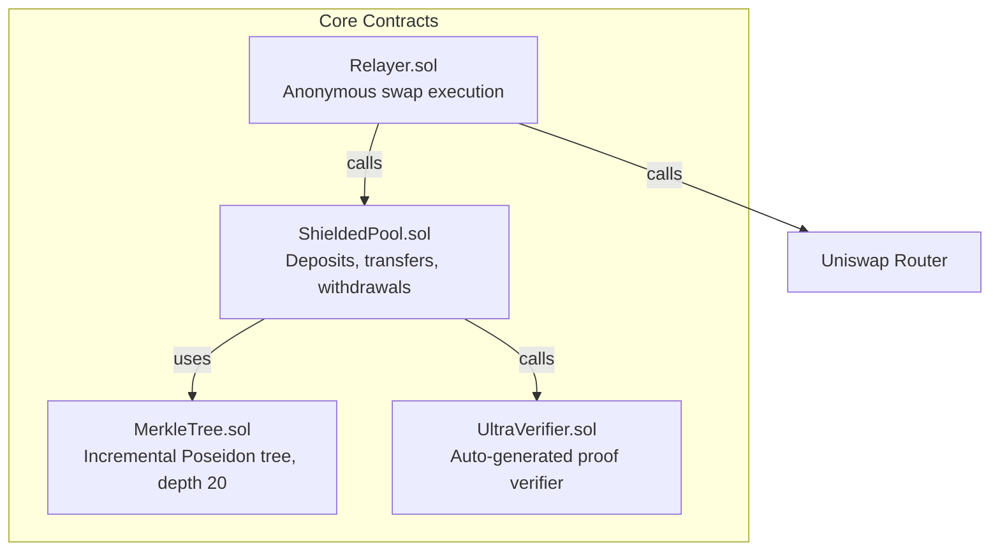

# Contract Spec — NullShift ZK Privacy Wallet

> **Version**: 0.1.0
> **Last Updated**: 2026-03-12

## Overview

Four smart contracts manage the on-chain state for NullShift's shielded pool system.



## Contract 1: ShieldedPool.sol

The core contract managing the privacy pool.

### State

```solidity
// Merkle tree of note commitments
MerkleTree public tree;                           // depth 20, ~1M notes

// Nullifier registry — prevents double-spend
mapping(bytes32 => bool) public nullifiers;

// Root history — accept last 100 roots (handle reorgs)
mapping(bytes32 => bool) public rootHistory;
bytes32[100] public roots;
uint256 public currentRootIndex;

// Verifiers (one per circuit type)
IVerifier public transferVerifier;
IVerifier public depositVerifier;
IVerifier public withdrawVerifier;

// Token balances
mapping(address => uint256) public tokenBalances;  // token => total shielded
```

### Functions

#### `deposit(bytes32 commitment) payable`
- Accept ETH, insert commitment into Merkle tree
- Emit `Deposit(bytes32 indexed commitment, uint256 leafIndex, uint256 amount)`
- Requirements: `msg.value > 0`, valid commitment (non-zero)

#### `depositERC20(address token, uint256 amount, bytes32 commitment)`
- Pull ERC-20 via SafeERC20.safeTransferFrom
- Insert commitment into Merkle tree
- Emit `DepositERC20(address indexed token, bytes32 indexed commitment, uint256 leafIndex, uint256 amount)`

#### `transact(bytes calldata proof, bytes32[2] nullifiers, bytes32[2] newCommitments, bytes32 root)`
- Verify `root` is in rootHistory
- Verify neither nullifier is spent
- Call `transferVerifier.verify(proof, [root, nullifiers[0], nullifiers[1], newCommitments[0], newCommitments[1]])`
- Mark nullifiers as spent
- Insert new commitments into tree
- Emit `ShieldedTransfer(bytes32[2] nullifiers, bytes32[2] newCommitments)`

#### `withdraw(bytes calldata proof, bytes32 nullifier, address recipient, uint256 amount, address token, bytes32 root)`
- Verify root, nullifier not spent
- Call `withdrawVerifier.verify(proof, [root, nullifier, recipient, amount])`
- Mark nullifier spent
- Transfer ETH or ERC-20 to recipient
- Emit `Withdraw(bytes32 indexed nullifier, address indexed recipient, uint256 amount, address token)`

### Security
- `ReentrancyGuard` on all external functions
- `SafeERC20` for all token transfers
- Nullifier check BEFORE proof verification (gas savings on replay)
- Root history prevents issues with block reorgs

### Gas Estimates

| Function | Estimated Gas |
|----------|--------------|
| deposit | ~150,000 |
| depositERC20 | ~180,000 |
| transact | ~450,000 |
| withdraw | ~280,000 |

## Contract 2: MerkleTree.sol (Library)

Incremental Merkle tree using Poseidon hash.

### Design
- Depth: 20 (supports 2^20 = 1,048,576 notes)
- Hash: Poseidon (ZK-friendly, matches circuit hash)
- Storage: Only current path stored (not all leaves) — gas optimization
- Zero values: Pre-computed for empty subtrees at each level

### Interface

```solidity
library MerkleTree {
    struct Tree {
        uint256 levels;
        uint256 nextIndex;
        mapping(uint256 => bytes32) filledSubtrees;
        bytes32 root;
    }

    function insert(Tree storage self, bytes32 leaf) internal returns (uint256 index);
    function getRoot(Tree storage self) internal view returns (bytes32);
    function zeros(uint256 level) internal pure returns (bytes32);
}
```

### Events
- `LeafInserted(bytes32 indexed leaf, uint256 indexed index, bytes32 root)`

## Contract 3: UltraVerifier.sol

Auto-generated by Barretenberg's `bb contract` command from Noir circuit artifacts.

### Interface

```solidity
interface IVerifier {
    function verify(
        bytes calldata proof,
        bytes32[] calldata publicInputs
    ) external view returns (bool);
}
```

One verifier per circuit type:
- `TransferVerifier.sol`
- `DepositVerifier.sol`
- `WithdrawVerifier.sol`
- `SwapVerifier.sol`

## Contract 4: Relayer.sol

Executes anonymous swaps on behalf of users.

### Functions

#### `executeSwap(bytes calldata proof, SwapParams calldata params)`

```solidity
struct SwapParams {
    bytes32 nullifier;
    bytes32 swapCommitment;      // hash(tokenIn, tokenOut, amount, minOutput, relayer)
    bytes32 changeCommitment;    // change note back to user
    bytes32 outputCommitment;    // re-shielded swap output
    address tokenIn;
    address tokenOut;
    uint256 swapAmount;
    uint256 minOutputAmount;
    uint256 relayerFee;
    bytes32 root;
}
```

**Flow:**
1. Verify swap proof against SwapVerifier
2. Verify nullifier not spent (via ShieldedPool)
3. Withdraw `swapAmount + relayerFee` from ShieldedPool
4. Execute swap on Uniswap Router
5. Re-shield output: deposit swap result as new commitment
6. Insert change commitment
7. Transfer relayer fee to `msg.sender`

### Security
- Relayer cannot steal: proof binds output to user's pubkey
- Slippage protection: `minOutputAmount` enforced on-chain
- Fee bounded: verified in ZK circuit
- Commit-reveal optional: prevent front-running

### Events
- `SwapExecuted(bytes32 indexed nullifier, address tokenIn, address tokenOut, uint256 amountOut, uint256 relayerFee)`

## Deployment Order

```mermaid
graph LR
    V[Verifiers<br/>TransferVerifier<br/>DepositVerifier<br/>WithdrawVerifier<br/>SwapVerifier] --> SP[ShieldedPool<br/>constructor(verifiers)]
    SP --> RL[Relayer<br/>constructor(pool, router)]
```

1. Deploy all verifier contracts
2. Deploy ShieldedPool with verifier addresses
3. Deploy Relayer with ShieldedPool + Uniswap Router addresses

## Related Docs

- [Architecture](ARCHITECTURE.md) — Where contracts fit in the system
- [Security](SECURITY.md) — Contract security checklist
- [Deployment](DEPLOYMENT.md) — Deploy procedures
- [Testing Plan](TESTING_PLAN.md) — Contract test strategy
