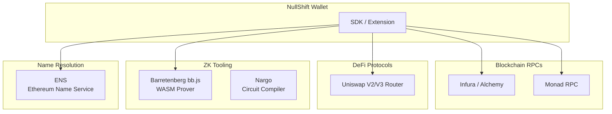

# Integration — NullShift ZK Privacy Wallet

> **Version**: 0.1.0
> **Last Updated**: 2026-03-12

## Third-Party Integrations



## 1. EVM RPC Providers

### Infura / Alchemy (Ethereum)

| Detail | Value |
|--------|-------|
| Purpose | Read chain state, submit transactions, listen to events |
| Auth | API key in extension settings (user-provided) |
| Endpoints | `eth_call`, `eth_sendRawTransaction`, `eth_getLogs`, `eth_getBlockByNumber` |
| Rate Limits | Free tier: 100k req/day (Alchemy), 100k req/day (Infura) |
| Privacy Note | RPC provider sees user's IP + queried addresses. Recommend private RPC or Tor. |

**Fallback Strategy**:
- Primary: User's configured RPC
- Fallback: Public RPC (less reliable, less private)
- Future: Built-in Tor proxy option

### Monad RPC

| Detail | Value |
|--------|-------|
| Purpose | Secondary chain support |
| Auth | API key |
| Endpoints | Standard EVM JSON-RPC |
| Status | Testnet only (MVP) |

## 2. Barretenberg (bb.js)

| Detail | Value |
|--------|-------|
| Purpose | Client-side ZK proof generation via WASM |
| Integration | NPM package `@aztec/bb.js` |
| Runtime | Offscreen Document (Chrome extension) |
| Auth | None (open source, runs locally) |
| Performance | ~8-15s per proof on mid-range hardware |

**Key APIs**:
```typescript
import { BarretenbergBackend } from '@noir-lang/backend_barretenberg';
import { Noir } from '@noir-lang/noir_js';

// Initialize
const backend = new BarretenbergBackend(circuit);
const noir = new Noir(circuit, backend);

// Generate proof
const proof = await noir.generateProof(inputs);

// Verify locally (for testing)
const valid = await noir.verifyProof(proof);
```

**WASM Considerations**:
- Must run in Offscreen Document (not service worker)
- CSP: `script-src 'self' 'wasm-unsafe-eval'`
- First proof is slower (WASM + proving key initialization)
- Cache proving keys in IndexedDB after first load

## 3. Uniswap Router (Anonymous Swaps)

| Detail | Value |
|--------|-------|
| Purpose | DEX for anonymous swaps via relayer |
| Contracts | Uniswap V2 Router (0x7a250d5630B4cF539739dF2C5dAcb4c659F2488D on Ethereum) |
| Auth | None (on-chain) |
| Integration | Via Relayer.sol contract |

**Swap Flow**:
1. User generates swap proof (SDK)
2. Relayer calls `Relayer.executeSwap()` on-chain
3. Relayer.sol calls Uniswap Router for the actual swap
4. Output re-shielded into user's new note

**Rate Limits**: N/A (on-chain)

**Slippage Protection**: `minOutputAmount` enforced in ZK circuit and on-chain

## 4. ENS (Ethereum Name Service)

| Detail | Value |
|--------|-------|
| Purpose | Resolve human-readable names to addresses |
| Integration | Via ethers.js `provider.resolveName()` |
| Auth | None |
| Rate Limits | Standard RPC call |

**Usage**: In send flow, allow recipient as ENS name (e.g., `vitalik.eth`)

## 5. EIP-1193 Provider (dApp Integration)

NullShift injects a provider for dApp compatibility.

### Supported Standard Methods

| Method | Description |
|--------|-----------|
| `eth_requestAccounts` | Returns public address (or shielded in privacy mode) |
| `eth_sendTransaction` | Routes through shielded pool if privacy mode on |
| `eth_sign` | Standard message signing |
| `personal_sign` | Personal message signing |
| `eth_chainId` | Current chain ID |
| `eth_accounts` | Connected accounts |
| `wallet_switchEthereumChain` | Switch network |

### NullShift Privacy Extensions

| Method | Description |
|--------|-----------|
| `nullshift_getShieldedBalance` | Shielded balance for connected account |
| `nullshift_sendShielded` | Direct shielded transfer |
| `nullshift_getPrivacyScore` | User's current privacy score |
| `nullshift_isShieldedMode` | Whether privacy routing is active |

### EIP-6963 Provider Discovery

```typescript
window.addEventListener('eip6963:requestProvider', () => {
  window.dispatchEvent(new CustomEvent('eip6963:announceProvider', {
    detail: {
      info: {
        uuid: 'nullshift-wallet-uuid',
        name: 'NullShift Wallet',
        icon: 'data:image/svg+xml,...',
        rdns: 'sh.nullshift.wallet'
      },
      provider: window.nullshift
    }
  }));
});
```

## Integration Testing

| Integration | Test Method |
|-------------|-----------|
| RPC Provider | Mock with Hardhat local node |
| Barretenberg | Real WASM in test environment |
| Uniswap | Fork mainnet state in Foundry |
| ENS | Mock resolver in tests |
| dApp Provider | Mock dApp page in Puppeteer |

## Related Docs

- [Architecture](ARCHITECTURE.md) — How integrations connect
- [Contract Spec](CONTRACT_SPEC.md) — On-chain contracts
- [Security](SECURITY.md) — Integration security considerations
- [Testing Plan](TESTING_PLAN.md) — Integration test strategy
