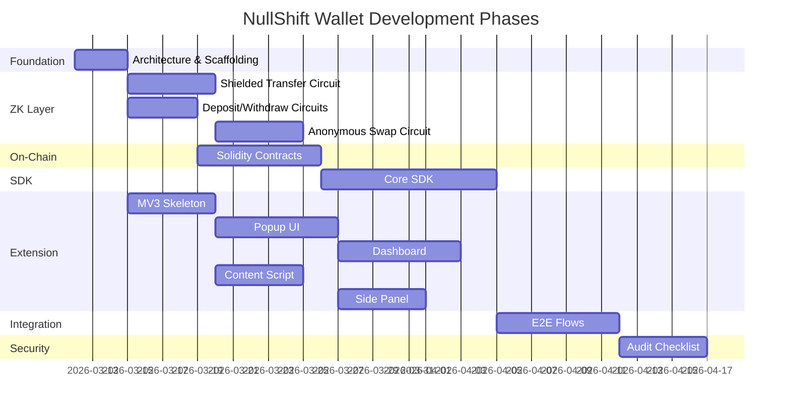

# Roadmap — NullShift ZK Privacy Wallet

> **Version**: 0.1.0
> **Last Updated**: 2026-03-12

## Phase Overview

## Phase 1: Foundation (MVP Architecture)

**Goal**: Monorepo structure, build pipeline, all docs in place.

- [ ] Scaffold monorepo with Turborepo + pnpm workspaces
- [ ] Configure webpack for Chrome extension multi-entry build
- [ ] Setup CI/CD (GitHub Actions) for circuits, contracts, SDK, extension
- [ ] All documentation generated and reviewed

**Exit criteria**: `pnpm install && pnpm build` succeeds across all packages.

## Phase 2: ZK Circuits

**Goal**: All four Noir circuits compile, pass tests, and generate valid proofs.

- [ ] `shielded_transfer` circuit — 2-in-2-out UTXO transfer
- [ ] `deposit` circuit — commitment preimage proof
- [ ] `withdraw` circuit — ownership + Merkle membership + nullifier
- [ ] `anonymous_swap` circuit — swap commitment + relayer model
- [ ] All circuits: `nargo test` passes
- [ ] Generate UltraVerifier.sol from each circuit

**Exit criteria**: All circuits compile, all tests pass, verifier contracts generated.

## Phase 3: Smart Contracts

**Goal**: On-chain contracts deployed to Sepolia testnet.

- [ ] `MerkleTree.sol` — Incremental Poseidon Merkle tree (depth 20)
- [ ] `ShieldedPool.sol` — Deposit, transact, withdraw with proof verification
- [ ] `Relayer.sol` — Anonymous swap execution
- [ ] Foundry tests with >90% coverage
- [ ] Deploy to Sepolia
- [ ] Verify contracts on Etherscan

**Exit criteria**: All contracts deployed and verified on Sepolia, forge tests pass.

## Phase 4: SDK

**Goal**: Core TypeScript library handles all crypto/ZK operations.

- [ ] Key management — HD derivation, ZK keys, encrypted vault
- [ ] Note management — create, encrypt, decrypt, scan, UTXO selection
- [ ] Proof generation — bb.js integration, all four circuit provers
- [ ] Merkle tree sync — event-driven sync from ShieldedPool
- [ ] Transaction builder — compose full tx flow

**Exit criteria**: SDK can generate proofs, build transactions, and interact with deployed contracts in automated tests.

## Phase 5: Chrome Extension

**Goal**: Functional extension with all UI surfaces.

- [ ] MV3 skeleton — manifest, service worker, offscreen document, build pipeline
- [ ] Popup UI — lock screen, home, send, receive, shield/unshield
- [ ] Dashboard — portfolio, note explorer, tx builder, DeFi hub, settings
- [ ] Content script — provider injection, dApp detection, message relay
- [ ] Side panel — activity feed, proof monitor, privacy dashboard

**Exit criteria**: Extension loads in Chrome, all screens render, background service worker handles messages.

## Phase 6: Integration

**Goal**: End-to-end flows working from UI through ZK proofs to on-chain execution.

- [ ] First-time setup flow (create wallet, derive keys, initial sync)
- [ ] Shield ETH flow (deposit to shielded pool)
- [ ] Shielded transfer flow (select UTXOs, generate proof, submit tx)
- [ ] Anonymous swap flow (connect dApp, route through relayer)
- [ ] Error handling and recovery (failed proofs, reverted txs, crash recovery)

**Exit criteria**: All four core flows complete successfully on Sepolia testnet.

## Phase 7: Security & Audit

**Goal**: Security review complete, ready for testnet public release.

- [ ] ZK circuit security review (constraint completeness)
- [ ] Smart contract security review (reentrancy, proof bypass, etc.)
- [ ] Extension security review (key handling, message validation, CSP)
- [ ] Privacy leak assessment (timing, metadata, graph analysis)
- [ ] Relayer security review
- [ ] Bug bounty program setup (optional)

**Exit criteria**: All critical/high items addressed, audit report generated.

## Future (Post-MVP)

### v1.1 — Multi-token Support
- ERC-20 shielded pools (USDC, WETH, etc.)
- Token-specific Merkle trees

### v1.2 — Monad Integration
- Deploy contracts to Monad
- Network switching in extension

### v1.3 — Advanced Privacy
- Stealth addresses
- Private NFT ownership
- Cross-chain private bridges

### v2.0 — Mobile
- React Native companion app
- WalletConnect integration for mobile dApps

## Related Docs

- [Architecture](ARCHITECTURE.md) — System design
- [Testing Plan](TESTING_PLAN.md) — Test strategy per phase
- [Deployment](DEPLOYMENT.md) — Deploy procedures
