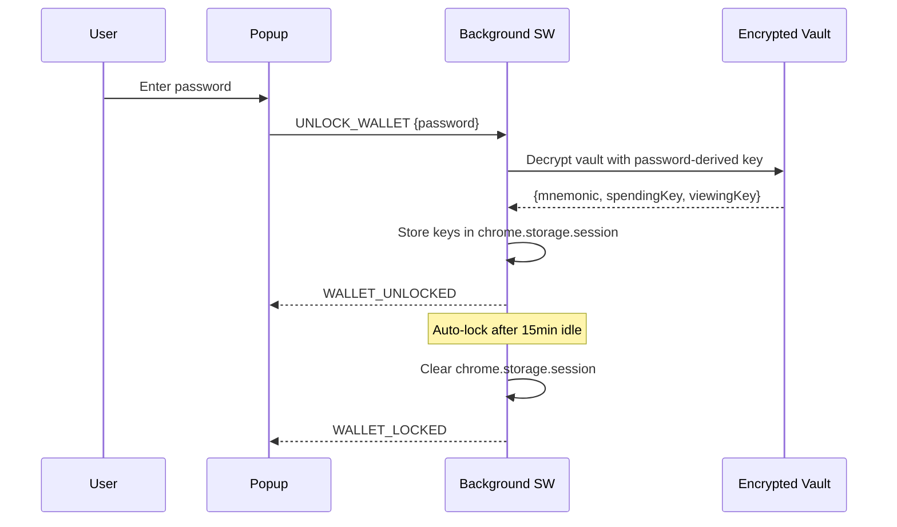

# Security — NullShift ZK Privacy Wallet

> **Version**: 0.1.0
> **Last Updated**: 2026-03-12

## Threat Model

### Assets to Protect

| Asset | Sensitivity | Storage |
|-------|------------|---------|
| Mnemonic / Seed Phrase | CRITICAL | Encrypted vault (chrome.storage.local) |
| Spending Key (ZK) | CRITICAL | Encrypted vault, decrypted only in session memory |
| Viewing Key | HIGH | Encrypted vault (can reveal balances, not spend) |
| Shielded Note Data | HIGH | Encrypted local cache |
| Transaction History | MEDIUM | Local storage, encrypted |
| User Password | CRITICAL | Never stored — used only to derive vault decryption key |

### Attack Vectors

```mermaid
graph TD
    A[Attacker] --> B[Extension Compromise]
    A --> C[Smart Contract Exploit]
    A --> D[ZK Circuit Vulnerability]
    A --> E[Network/Privacy Leak]
    A --> F[Relayer Attack]
    A --> G[Social Engineering]

    B --> B1[XSS in popup/dashboard]
    B --> B2[Malicious content script interaction]
    B --> B3[Storage theft]
    B --> B4[Service worker hijack]

    C --> C1[Reentrancy]
    C --> C2[Proof bypass]
    C --> C3[Nullifier manipulation]
    C --> C4[Merkle root poisoning]

    D --> D1[Under-constrained circuit]
    D --> D2[Amount overflow]
    D --> D3[Double-spend via nullifier collision]

    E --> E1[RPC metadata leaks]
    E --> E2[Timing analysis]
    E --> E3[dApp fingerprinting]

    F --> F1[Front-running]
    F --> F2[Censorship]
    F --> F3[Fee manipulation]
```

## ZK Circuit Security

| Check | Risk | Mitigation | Status |
|-------|------|-----------|--------|
| All private inputs properly constrained | Critical | Formal review of each constraint | [ ] Pending |
| Nullifier uniqueness guaranteed | Critical | `nullifier = Poseidon(commitment, secret_key)` is deterministic | [ ] Pending |
| Merkle proof cannot be forged | Critical | Verify full path against public root | [ ] Pending |
| Amount range checks (u64) | Critical | Prevent overflow/wrapping attacks | [ ] Pending |
| Proofs bound to specific Merkle root | High | Root is public input, contract checks root history | [ ] Pending |
| Viewing key cannot derive spending key | High | One-way derivation: `viewing_key = hash(spending_key)` | [ ] Pending |
| Zero-note handling | Medium | Zero-amount notes don't leak info about single-input txs | [ ] Pending |

## Smart Contract Security

| Check | Risk | Mitigation | Status |
|-------|------|-----------|--------|
| Reentrancy on deposit/withdraw | Critical | OpenZeppelin ReentrancyGuard on all external functions | [ ] Pending |
| Proof verification cannot be bypassed | Critical | Verifier called before any state changes | [ ] Pending |
| Nullifier double-spend prevention | Critical | `mapping(bytes32 => bool) nullifiers` checked before transact | [ ] Pending |
| Merkle root history (handle reorgs) | High | Store last 100 roots, accept any valid recent root | [ ] Pending |
| ERC-20 transfer safety | High | OpenZeppelin SafeERC20 for all token interactions | [ ] Pending |
| Front-running nullifiers | Medium | Nullifier is proof-derived (attacker can't predict) | [ ] Pending |
| Contract upgradeability | Medium | Immutable deployment (no proxy) — v1 decision | [ ] Pending |

## Extension Security

| Check | Risk | Mitigation | Status |
|-------|------|-----------|--------|
| Private keys never in storage.local unencrypted | Critical | AES-256-GCM encryption, keys only decrypted to session memory | [ ] Pending |
| Service worker doesn't persist sensitive data | Critical | Clear session data on lock, use chrome.storage.session | [ ] Pending |
| Content script isolation | High | Cannot access extension internal state, strict message validation | [ ] Pending |
| Inpage script sandboxed | High | Runs in page's main world, no chrome.* API access | [ ] Pending |
| Message origin validation | High | Check `sender.id` and message source on all cross-context messages | [ ] Pending |
| No eval() or dynamic code execution | High | CSP: `script-src 'self' 'wasm-unsafe-eval'` | [ ] Pending |
| XSS prevention in React UI | High | React auto-escapes, no dangerouslySetInnerHTML | [ ] Pending |

## Privacy Leak Prevention

| Check | Risk | Mitigation | Status |
|-------|------|-----------|--------|
| RPC metadata leaks | High | Option for private RPC / Tor-routed requests | [ ] Pending |
| Transaction timing analysis | Medium | Random delay (1-30s) before proof submission | [ ] Pending |
| dApp fingerprinting | Medium | Minimal info exposed via provider, no extension version leak | [ ] Pending |
| Note denomination analysis | Medium | Encourage standard denominations (0.1, 1, 10 ETH) in UI | [ ] Pending |
| Graph analysis on withdraw | Medium | UI warning: "Wait for anonymity set growth before withdrawing" | [ ] Pending |
| IP address correlation | Medium | Recommend VPN/Tor for maximum privacy | [ ] Pending |

## Relayer Security

| Check | Risk | Mitigation | Status |
|-------|------|-----------|--------|
| Relayer cannot steal funds | Critical | Proof binds output to user's pubkey — relayer has no spending key | [ ] Pending |
| Relayer front-running | High | Commit-reveal scheme or encrypted swap params | [ ] Pending |
| Relayer censorship | Medium | Multiple relayer support, direct submission fallback | [ ] Pending |
| Fee manipulation | Medium | Max fee bound in circuit, user approves fee before signing | [ ] Pending |

## Secrets Management

### What goes in .env (NEVER committed)
- RPC API keys
- Deployer private keys (testnet)
- Relayer private keys

### What goes in encrypted vault
- User mnemonic
- Spending key
- Viewing key
- Nullifier key

### What is public
- Contract addresses
- ACIR artifacts (circuit definitions)
- Verification keys

## Auth Flow

## Audit Preparation

Before mainnet deployment:
1. [ ] Internal review of all Noir circuits
2. [ ] Foundry fuzz testing with 10,000+ runs
3. [ ] External smart contract audit
4. [ ] Extension security review (Chrome Web Store requirements)
5. [ ] Privacy analysis: anonymity set modeling
6. [ ] Formal verification of critical circuit constraints (if feasible)

## Related Docs

- [Architecture](ARCHITECTURE.md) — System design context
- [Contract Spec](CONTRACT_SPEC.md) — Contract details
- [Testing Plan](TESTING_PLAN.md) — Security test cases
